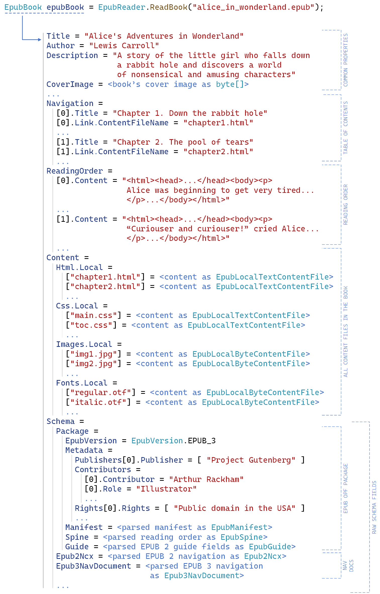

<picture>
  <source media="(prefers-color-scheme: dark)" srcset="Documentation/images/logo-with-title-dark.svg">
  <source media="(prefers-color-scheme: light)" srcset="Documentation/images/logo-with-title-light.svg">
  
</picture>

.NET library for reading EPUB files.

Supported EPUB standards:
* EPUB 2 (2.0, 2.0.1)
* EPUB 3 (3.0, 3.0.1, 3.1, 3.2)

Supported runtimes:
* .NET Standard >= 1.3 (includes .NET Core >= 1.0 and .NET >= 5)
* .NET Framework >= 4.6

[Download](#download-the-latest-stable-release) | [Documentation](https://os.vers.one/EpubReader/) | [WPF & .NET 6 console demo apps](#demo-apps)

## EpubReader in a nutshell

## Demo apps
* [Download WPF demo app](https://github.com/vers-one/EpubReader/releases/latest/download/WpfDemo.zip) (WpfDemo.zip)

  This .NET Framework application demonstrates how to open EPUB books and extract their content using the library.

  HTML renderer used in this demo app may have difficulties while rendering content for some of the books if the HTML structure is too complicated.

* [Download .NET 6 console demo app](https://github.com/vers-one/EpubReader/releases/latest/download/ConsoleDemo.zip) (ConsoleDemo.zip)

  This .NET 6 console application demonstrates how to open EPUB books and retrieve their text content.

## Examples
1. [How to extract the table of contents.](https://os.vers.one/EpubReader/examples/example-1.html)
2. [How to extract the plain text of the whole book.](https://os.vers.one/EpubReader/examples/example-2.html)
3. [How to iterate over all EPUB files in a directory and gather some stats.](https://os.vers.one/EpubReader/examples/example-3.html)

## Download the latest stable release
* [Download from nuget.org](https://www.nuget.org/packages/VersOne.Epub)
* DLL file from GitHub:
  * [for .NET Framework](https://github.com/vers-one/EpubReader/releases/latest/download/VersOne.Epub.Net46.zip)
  * [for .NET Standard](https://github.com/vers-one/EpubReader/releases/latest/download/VersOne.Epub.NetStandard.zip)
